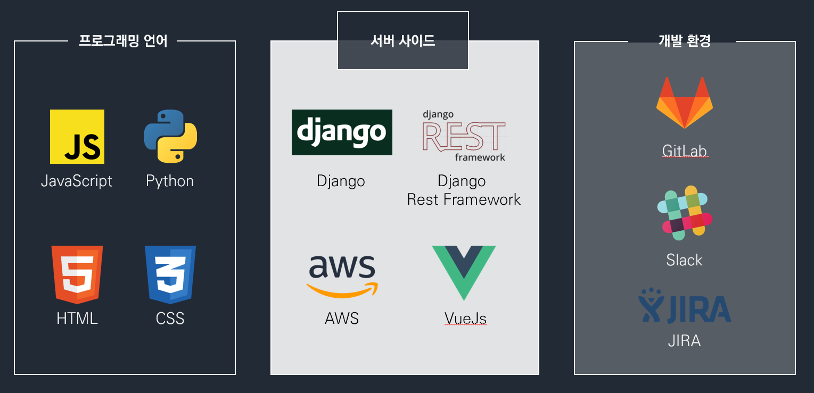

# Hey &NERD - README
## 1. 프로젝트 개요
본 프로젝트는 Hey &Nerd로 빅데이터를 활용한 영화 추천 서비스입니다.

1894년부터 2019년까지의 영화를 콘텐츠 공급원으로 유저에게 영화의 세계를 탐험하고 무엇을 볼 것인지를 결정하도록 돕기 위하여 만든 서비스입니다.

Hey &Nerd의 데이터베이스는 수백만 편의 영화와 출연진과 제작진을 포함하고 있으며, 즐겁게 본 영화와 관련된 영화를 추천하는 식으로 영화 커뮤니티를 제공하고 있습니다.

영화를 추천 받는 유저를 위하여, Hey &Nerd는 영화의 장르, 상영 시간, 예고편, 줄거리, 평가, 배우, 감독 등 다양한 정보를 제공하고 있으며, 총 365,454편의 영화를 추천합니다. 또한, 추천 받은 영화와 유사한 영화를 찾아주면서 영화 추천망을 구성하고 있습니다.

본 프로젝트는 삼성 청년 소프트웨어 아카데미(SSAFY)에서 2019.08.19 ~ 2019.10.11 (총 7주)의 기간동안 진행했습니다.
## 2. 개발환경
- Visual Studio Code
- Python 3.5.3
- Django 2.1.7, Django REST Framework
- Sqlite3
- Vue 3.8.4, Vuex, Vue-router


## 3. 서비스 배포 환경
  - FrontEnd : AWS S3
  - BackEnd : AWS EC2
  - DataBase : AWS RDS
  - Algorithm : AWS Lambda

  
## 4. 서비스 개요
- 영화를 추천받기 위해서 회원 정보를 등록한 후 웹 서비스를 통해 영화를 추천 받으면 됩니다. 회원 정보를 등록하기 전엔 무작위의 영화를 추천 받으며, 회원 정보를 등록하면, 회원 맞춤별 영화를 추천해줍니다.
- 혹은 영화를 API를 활용하여 받을 수 있습니다. API Document는 `http://52.78.2.29/swagger/`에서 확인할 수 있습니다.
- 영화 정보는 `https://www.imdb.com/` 에서 1894년에서 2019년 개봉 예정작까지 모든 영화를 크롤링으로 가져왔습니다. 이 중 영화의 예고편도 크롤링 해와서 영화 디테일 페이지에 반영합니다. 2019년 10월 11일 기준 총 365,454편의 영화가 포함되었습니다.
## 5. Algorithm
- Clustering Algorithm
  - K-Means
  - Hierarchical
  - EM
  - 위의 Clustering Algorithm을 활용하여 사용자와 영화를 Clustering 해서 비슷한 특성의 사용자나 영화를 보여줬습니다.
- Recommendation Algorithm
  - KNN
    - User Based : 유저 기반 추천 모델
    - Item Based : 영화 기반 추천 모델
  - Matrix Factorization
    - Collaborative Filtering
  - 위의 Recommendation Alogrithm을 활용하여 사용자 맞춤 영화를 추천줍니다.
## 6. 서비스 아케텍처
- ERD model (사용한 프로그램 : https://dbdiagram.io/)

  
- 관리자 페이지 (/admin): 관리자는 유저들의 정보를 확인할 수 있으며, Algorithm의 인자를 변경할 권한이 있습니다.
- 회원가입, 로그인, 로그아웃, 프로필 수정, 영화 평점 남기기가 가능합니다.
- 회원가입 및 로그인시 비밀번호는 Django Framework 기본 기능으로 모두 암호화가 되며, 데이터베이스에 기록되는 모든 정보는 Django ModelForm을 통해 유효성을 검사합니다.
## 7. 프로젝트 정보
- **데이터 정보**

  - 영화 : 365,454편 (1894년 ~ 2019년)
  - 유저 : 6,056명
  - 평점 : 882,055개

  
- **팀원 정보 및 업무 분담 내역**
```
- 이혜희 : 팀장, Vue, HTML, CSS를 이용한 프론트엔드
- 한동훈 : Vue, HTML, CSS를 이용한 프론트엔드와 numpy, pandas를 이용한 데이터전처리
- 강민수 : Django를 이용한 백엔드 서버 구축 및 영화 데이터 크롤링
- 강성진 : 군집, 추천 알고리즘을 이용한 추천 시스템 구축
- 이민영 : 군집, 추천 알고리즘을 이용한 추천 시스템 구축
```
- **목표 서비스 구현 및 실제 구현 정도**
  - 회원 개인 정보, 구독 등 많은 유저 정보 수정, 열람 구현
  - 회원 정보별 맞춤 영화 추천을 위한 회원가입, 로그인, 로그아웃 구현
  - 회원 맞춤별 영화 추천 구현
  - Algorithm 인자 변경하는 Admin Page 구현

- **데이터베이스 모델링**

  - Movie: 영화 정보를 저장하기 위한 DB 테이블
  - Comment: 유저들이 작성한 한줄평을 저장하기 위한 DB 테이블
  - Profile: 가입시 지정한 닉네임 및 영화 선택 내용을 저장한 DB 테이블
  - 자세한 내용은 위의 ERD model을 참고바랍니다.

- **핵심 기능**
  - 회원 정보별 영화를 추천하는 서비스입니다. 영화의 예고편, 간략한 줄거리, 영화별 평가들을 한 눈에 확인할 수 있으며, 영화 시청 장려를 위한 영화 명장면 영상, 월페이퍼를 삽입하여 영화 시청을 하도록 만들었습니다.

- **배포 서버**
  - http://hayelyandnerds.s3-website-us-east-1.amazonaws.com/

- **시연 영상**
  - https://www.youtube.com/watch?v=A8tlJ6eTw_E

- **기타**
  - 느낀점
    - 이혜희: 앞으로 계획을 잘 세우고 미리미리 잘 하겠습니다. Scrum 회의를 꼭 진행하겠습니다.
    - 한동훈: 욕심을 가지고 기능을 한꺼번에 만들기 보다는 하나의 큰 줄기를 두고 뻗어나가는 식으로 개발을 해야하는 것을 느꼈습니다.
    - 강민수: Scrum 회의의 필요성을 절실히 느꼈습니다.
    - 강성진: 빅데이터는 까다롭다.
    - 이민영: 빅데이터는 어렵다.
